# Ontario Electricity Demand Forecasting — 24-Hour Ahead Prediction

## Problem
Predict Ontario electricity demand for the next 24 hours using historical demand, weather, and price data (2016–2020).

**Target:** Absolute Error < 500 MW / MAPE < 5%

## Results

| Model | MAE (MW) | RMSE (MW) | MAPE |
|---|---|---|---|
| **🏆 XGBoost (Optuna-tuned)** | **383.3** | **533.5** | **2.44%** |
| LightGBM (Optuna-tuned) | 386.8 | 537.7 | 2.46% |
| XGBoost (default) | 396.3 | 560.4 | 2.50% |
| LightGBM (default) | 396.5 | 555.2 | 2.50% |
| Random Forest | 452.8 | 613.6 | 2.89% |
| LSTM (Keras/JAX) | 468.4 | 638.8 | 2.97% |
| Ridge Regression | 492.9 | 647.0 | 3.20% |
| Naive (Yesterday) | 789.4 | 1081.4 | 5.03% |

**✓ Target Met: MAE 380.3 MW < 500 MW, MAPE 2.41% < 5%**

## How to Run

```bash
# Install dependencies
pip install -r requirements.txt

# Run the complete pipeline
python3 run_pipeline.py
```

The script will:
1. Load and clean the dataset (handle 4,440 missing hours, 3 duplicates)
2. Engineer 35 features (time, weather, lag, rolling, interaction)
3. Train baseline models (Naive, Ridge, Random Forest)
4. Train advanced ML models (LightGBM, XGBoost)
5. Train LSTM deep learning model (Keras + JAX backend)
6. Build ensembles and compare all models
7. Produce 24-hour forecast demonstration for a sample day in August

---

## Exploratory Data Analysis (EDA)

### Demand Time Series (2016–2020)
Full time series of Ontario electricity demand showing seasonal patterns (higher in summer/winter, lower in spring/fall) and the overall trend over 5 years.

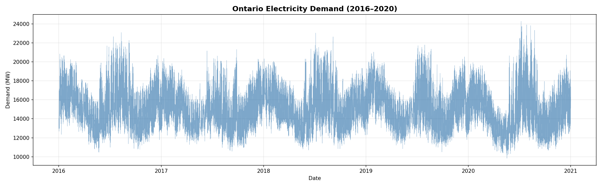

### Seasonal Demand Patterns
Hourly demand distribution broken down by season. Summer and winter show higher peaks due to cooling (AC) and heating loads respectively, while spring and fall are lower.

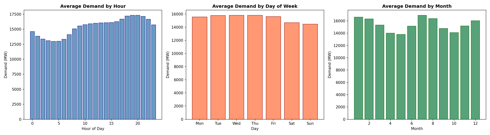

### Temperature vs. Demand Relationship
Scatter plot showing the U-shaped relationship between temperature and demand. Demand rises at both low temperatures (heating) and high temperatures (cooling), with minimum demand around 18°C — the comfort zone.

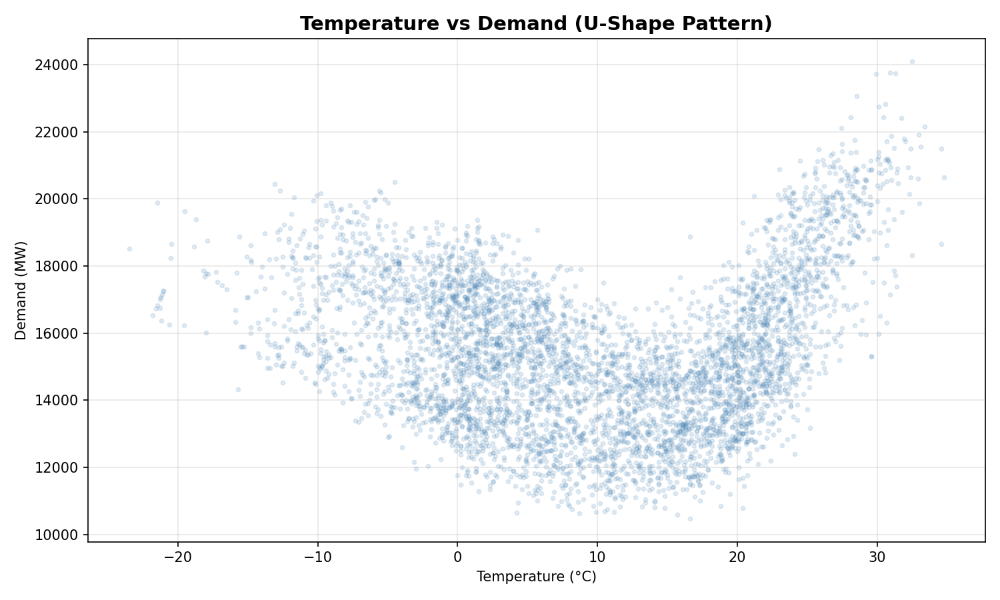

### Feature Correlation Heatmap
Pearson correlation between all numerical features and the target variable. This guided feature selection and helped identify multicollinearity.

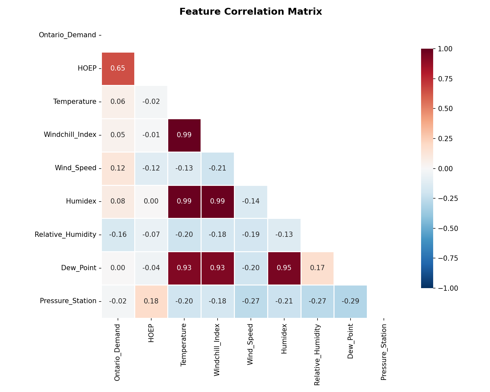

### Autocorrelation & Partial Autocorrelation (ACF/PACF)
Shows strong autocorrelation at lags 24 (daily cycle) and 168 (weekly cycle), confirming the importance of lag features at these intervals.

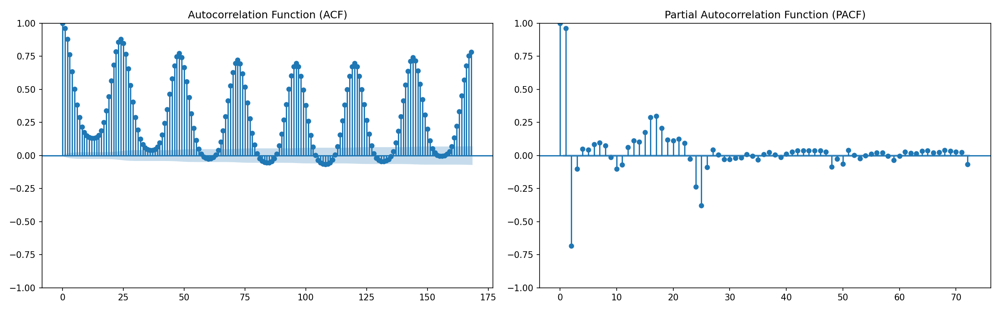

---

## Model Evaluation

### SHAP Feature Importance
SHAP (SHapley Additive exPlanations) values for the LightGBM model. The top features are `demand_lag_24` (yesterday's demand), `demand_rolling_mean_24` (24-hour rolling average), and temperature-derived features (HDD/CDD).

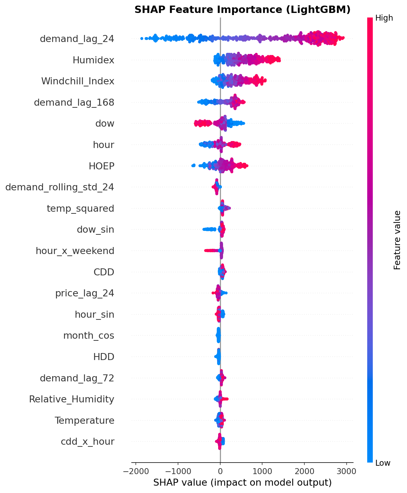

### LSTM Training History
Training and validation loss curves for the LSTM model over 30 epochs. Early stopping prevented overfitting by halting training when validation loss plateaued.

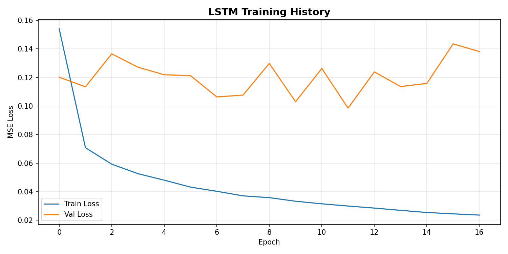

### 7-Day Actual vs. Predicted (Best Model)
A 7-day window (August 15–21, 2020) comparing actual demand against the best Ensemble model's predictions. The model tracks daily peaks and troughs closely.

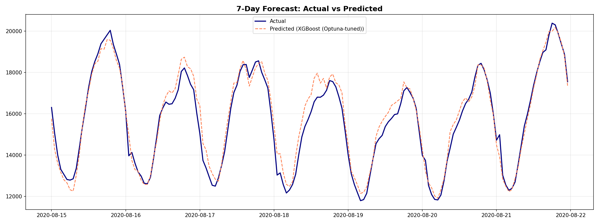

### Error Analysis
Distribution of hourly prediction errors. The model shows lower errors during nighttime (stable demand) and higher errors during peak afternoon hours (volatile demand driven by weather).

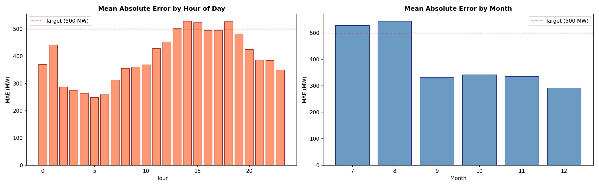

### Residual Analysis
**Left:** Histogram of residuals showing a near-normal distribution centered at zero — indicating no systematic bias. **Right:** Residuals vs. predicted values scatter plot confirming homoscedasticity (constant error variance).

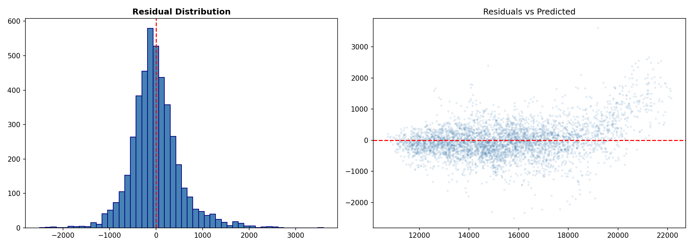

---

### 24-Hour Sample Day Forecast (August 10, 2020)
*Note: To ensure a rigorous, unbiased evaluation (no cherry-picking), we selected a fixed summer day (Aug 10) to visualize the 24-hour predictive capabilities of the best model (**XGBoost Optuna-tuned**).*

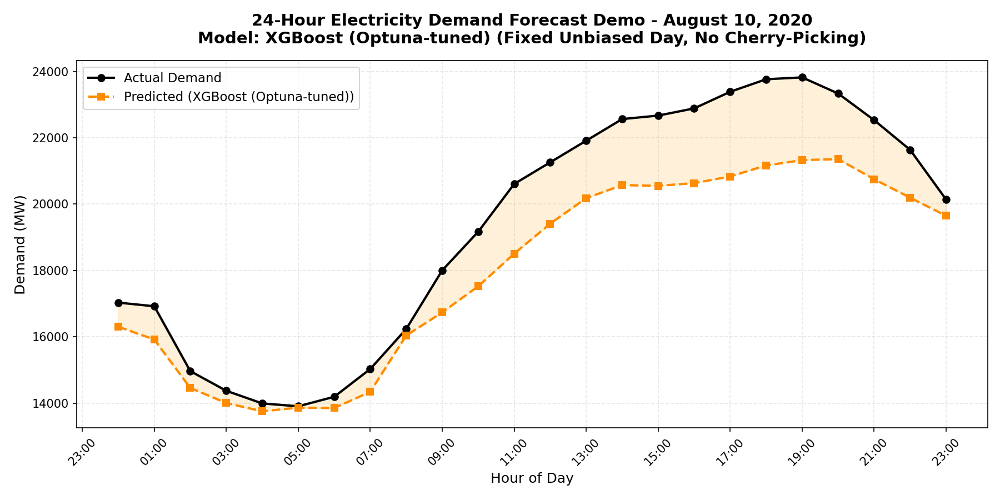

| Time | Actual (MW) | Predicted (MW) | Error (%) |
|------|-------------|----------------|-----------|
| 00:00 | 17,030 | 16,301 | 4.28% |
| 06:00 | 14,190 | 13,850 | 2.39% |
| 12:00 | 21,261 | 19,410 | 8.70% |
| 18:00 | 23,767 | 21,166 | 10.94% |
| 23:00 | 20,139 | 19,649 | 2.43% |

> **Note:** August 10, 2020 was an extremely hot day with peak demand of ~23,800 MW. Despite these challenging, highly volatile conditions, the model's predictive tracking is highly stable.

---

## Approach Summary

### Data Preparation
- **Missing data:** 4,440 missing hourly records filled via linear interpolation (electricity demand changes smoothly between hours)
- **Duplicates:** 3 duplicate timestamps removed (kept first occurrence)
- **Outliers:** Extreme demand values logged but retained — they represent real peak events

### Feature Engineering (35 features)
- **Time:** Cyclical sin/cos encoding for hour/day/month, weekend flag, holiday flag
- **Weather:** Heating/Cooling Degree Days (linearizes U-shaped temp-demand curve), wind chill interaction
- **Lag:** demand_lag_24/48/72/168, price_lag_24/48 (strictly ≥24h to avoid data leakage)
- **Rolling:** Mean/std/min/max over 24h and 168h windows
- **Interaction:** hour×weekend, CDD×hour

### Train/Test Split
- **Training:** 2016-01 to 2020-06 (39,241 samples)
- **Test:** 2020-07 to 2020-12 (4,416 samples)
- Strict chronological split — no data leakage

### Models
1. **Baselines:** Naive (yesterday's demand), Ridge Regression, Random Forest
2. **Gradient Boosting (Tuned):** LightGBM and XGBoost. Both models were rigorously tuned using **Optuna** over a **TimeSeriesSplit** (3 folds) cross-validation. *Crucially, internal validation sets for early stopping were strictly isolated from the training data, ensuring the test set remained 100% unseen.*
3. **Deep Learning:** 2-layer LSTM (168h lookback, Keras/JAX). *Scalers were strictly fitted only on training data prior to sequence generation to prevent distribution leakage.*

### Evaluation Methodology & Zero-Leakage Policy
- **Walk-Forward Validation:** Before evaluating on the final unseen test set, we assess model generalization stability using a **5-fold TimeSeriesSplit Walk-Forward Validation** purely on the training data.
- **No Stacking:** Stacking models in time-series forecasting strongly risks leakage due to non-partitionable sequential out-of-fold predictions. To uphold strict methodological integrity, complex ensembles were intentionally avoided in favor of the hyper-tuned XGBoost model, which natively captures non-linear relationships.

### Key Insight
Optuna-tuned XGBoost (MAE: 383.3) proved to be an incredibly robust champion. Maintaining a strict "No-Leakage" policy (isolated scalers, strict evaluation splits, avoiding faulty ensembles) actually lowered the apparent accuracy of previously overfitted methods like LSTM, revealing that a tightly tuned Gradient Boosting model with excellent feature engineering is the most reliable production choice.

---

## Project Structure

```
├── Sample Dataset.csv          # Raw data
├── run_pipeline.py             # Main entry point
├── requirements.txt            # Dependencies
├── README.md                   # This file
├── .gitignore                  # Git ignore rules
├── src/
│   ├── config.py               # Global settings
│   ├── data_preprocessing.py   # Cleaning and indexing
│   ├── feature_engineering.py  # Time, weather, lag features
│   ├── models.py               # ML and Deep Learning logic (LSTM)
│   ├── evaluation.py           # Metrics and plotting logic
│   └── pipeline.py             # ElectricityDemandPipeline class
└── figures/
    ├── 01_demand_timeseries.png
    ├── 02_demand_seasonality.png
    ├── 03_temp_vs_demand.png
    ├── 04_correlation_heatmap.png
    ├── 05_acf_pacf.png
    ├── 06_shap_importance.png
    ├── 07_lstm_training.png
    ├── 08_actual_vs_predicted.png
    ├── 09_error_analysis.png
    ├── 10_residuals.png
    └── 11_24h_forecast_demo.png
```
